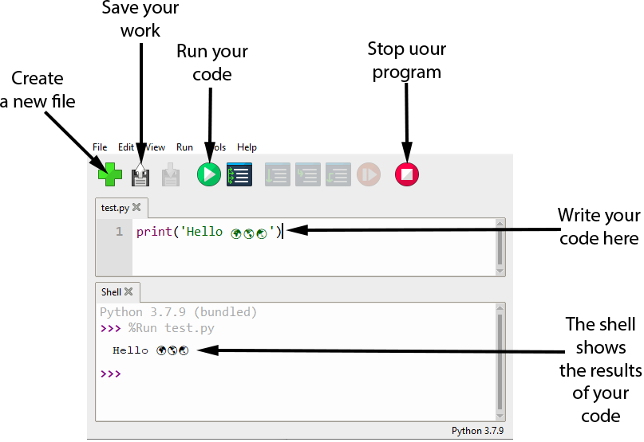

## Using Python offline

To use the Python programming language offline, you will need to have Python installed and access to a text editor or an Interactive Development Environment (IDE) with Python support. 

Thonny is a learner friendly IDE that comes packaged with Python.

You can download Thonny for MicroSoft Windows, macOS and Linux at [https://thonny.org/](https://thonny.org/)

The two main areas are the **Scripts tabs** where you write your Python program, and the **Shell** where the results of your program will be displayed.

There are standard icons in the tool bar for creating new files, saving your work, and running or stopping your programs.